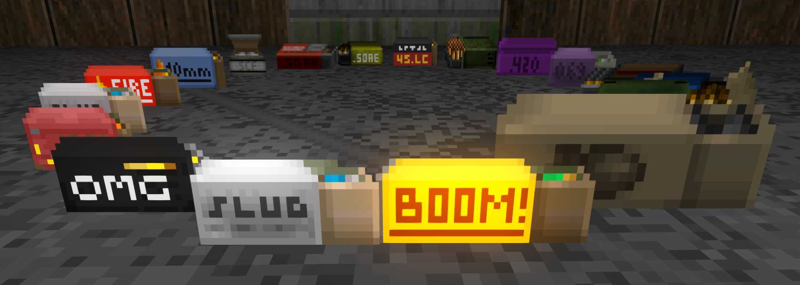
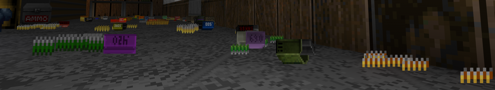

# Reusable Ammoboxes

A continuation of Testament Holmes' [Legacy Ammoboxes](https://dastrukar.gitlab.io/hddons-list/#utilities:legacyammoboxes-testamentholmes), now with HDBulletLib boxes!

_"The old UaS ammoboxes, re-implemented as an standalone mod. Now with empty sprites! This version replaces the normal HD pickups."  
~ Testament Holmes_

Basically brings back UaS's old persistent ammo boxes for _immersion_, and probably some sort of inventory management or pedantry, who am I to decide?

_Currently Supports all of these ammoboxes!_

_such clutter, many immersions, wow!_

## Credits:
- Original code and rocket box sprite by Sterling Parker (aka "Caligari87").
- Slight code alterations and new empty vanilla boxes sprites by Testament_Holmes.

- The Peppergrinder Team for the 12g slug, .500 S&W Light/Heavy, the .420 Frei, and the .069 Bore boxes
- Swampyrad for the 10mm, 12g explosive slugs & less-lethal shells, .45 LC, and flare shell boxes
- Bogus for the .50 OMG boxes
- Popguy for the .45 ACP boxes
- Khan for the 4g saboted slug boxes
- Potetobloke for the 5mm, 6mm, and .50 AM boxes
- HexaDoken for the .30-06 boxes
- Underqualified_Gunman for the empty FreeDoom 12ga Shell boxes